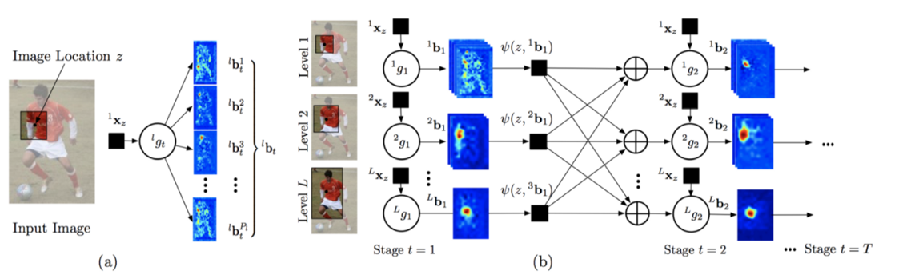
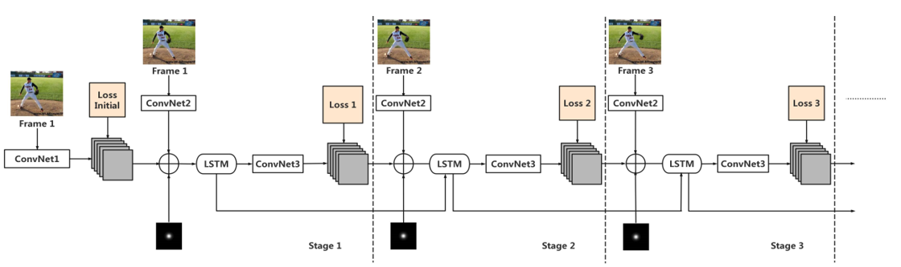
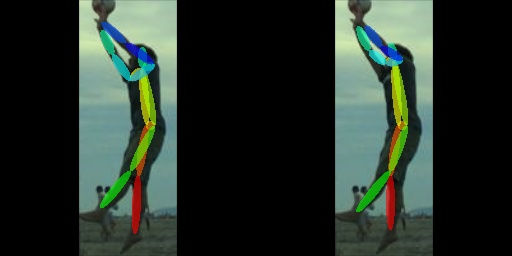
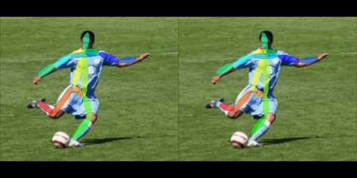
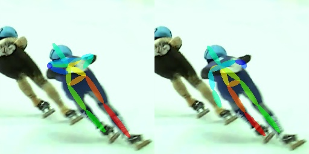
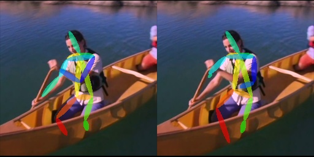

MobilePose-master
===
[](https://pepy.tech/project/MobilePose-master)
## Introduction
This is a recurrent pytorch implementation of [LSTM_Pose_Machines](https://github.com/lawy623/LSTM_Pose_Machines).the source code of the paper: "[LSTM Pose Machines" (CVPR'18)](https://arxiv.org/abs/1712.06316) by Yue Luo, Jimmy Ren, Zhouxia Wang, Wenxiu Sun, Jinshan Pan, Jianbo Liu, Jiahao Pang, Liang Lin. 

Also the recurrent include the implementation of the single image pose estimation method "[Convolutional Pose Machines(CPMs)](https://arxiv.org/abs/1602.00134)" on videos. Second one is our LSTM Pose Machines on video pose estimation.

The main network structure is listed as below:
### CPM


<div align="center">
	
</div>

### LPM

<div align="center">
    	
</div>

## Main Results

###  Task1: Single-Person Pose Estimation on LSP dataset

### Examples

<div align="center">
    
    
</div>


### Results

| Method | Head | Shoulder | Elbow | Wrist  | Hip | Knee | Ankle| Total |
|:-------|:-----:|:-------:|:-------:|:-------:|:-------:|:-------:|:-------:|:-------:|
| **CPM** | **95.4%** | **95.2%** | **85.2%** | **78.1%** | **95.5%** | **86.2%** | **76.4%** | **86.8%** |
| **LPM** | **90.4%** | **86.3%** | **83.3%** | **75.9%** | **93.1%** | **88.4%** | **84.1%** | **88.1%** | 


###  Task2: Single-Person Pose Estimation on MPII dataset

### Examples

<div align="center">
    
    
</div>

### Results

| Method | Head | Shoulder | Elbow | Wrist  | Hip | Knee | Ankle| Total |
|:-------|:-----:|:-------:|:-------:|:-------:|:-------:|:-------:|:-------:|:-------:|
| **CPM** | **61.6%** | **76.%** | **64.4%** | **56.2%** | **77.8%** | **71.4%** | **61.9%** | **67.7%** |
| **LPM** | **79.9%** | **86.1%** | **75.2%** | **67.5%** | **85.1%** | **71.3%** | **67.4%** | **76.2%** | 


###  Task3: Single Person Pose Estimation on Penn Action dataset

### Examples

<div align="center">
    
    
</div>


### Results

| Method | Head | Shoulder | Elbow | Wrist  | Hip | Knee | Ankle| Total |
|:-------|:-----:|:-------:|:-------:|:-------:|:-------:|:-------:|:-------:|:-------:|
| **CPM** | **97.5%** | **96.7%** | **91.1%** | **85.4%** | **97.5%** | **91.6%** | **86.3%** | **92.8%** |
| **LPM** | **95.2%** | **96.7%** | **95.6%** | **98.2%** | **95.6%** | **96.4%** | **97.1%** | **96.2%** | 

## Environment
The code is developed using python 3.6 on Ubuntu 16.04. NVIDIA GPUs are needed. The code is developed and tested using 4 NVIDIA P100 GPU cards. Other platforms or GPU cards are not fully tested.

## Preparation
1. Init output(training model output directory) and log(tensorboard log directory) directory.

   ```
   mkdir output 
   mkdir log
   ```

   and your directory tree should look like this

   ```
   ${MobilePose-master}
   ├── data
   ├── datasets
   ├── experiments
   ├── logs
   ├── models
   ├── output
   ├── utils
   ├── train.py
   ├── valid.py
   ├── test.py 
   ```

### Data preparation
**For LSP data** 
Download the [LSP](http://sam.johnson.io/research/lsp.html) dataset and extract them under {MobilePose-master}/data, and make them look like this:
(Be noted that the train image folder /images_10000 come from the original folder LSP/train/lsp_dataset/images, and the val image folder /images_2000 come from the original folder LSP/val/lsp_dataset/images )
```
${MobilePose-master}
|-- data
`-- |-- LSP
    `-- |-- joints_2000.mat 
        |-- joints_10000.mat 
        |-- means.npy 
        |-- images_10000
        |   |--im00001.jpg
        |   |--im00002.jpg
        |   |--...
        |   |--im10000.jpg
        |-- images_2000
        |   |--im0001.jpg
        |   |--im0002.jpg
        |   |--...
        |   |--im2000.jpg
        |   
```

**For MPII data** 
Download the [MPII](http://human-pose.mpi-inf.mpg.de/) dataset and extract them under {MobilePose-master}/data, and make them look like this:

```
${MobilePose-master}
|-- data
`-- |-- MPII
    |-- |-- annot 
        |-- images
   	|   |-- 000001163.jpg
        |   |-- 000003072.jpg
	    |--...
        |   |-- 000003122.jpg
        |-- train.json
	|-- valid.json
```


**For Penn Action data** 
Download the [Penn Action](http://dreamdragon.github.io/PennAction/) dataset and extract them under {MobilePose-master}/data, and make them look like this:
(Be noted that the **get_LMDB.ipynb** is used to generate **train.lmdb** and **valid.lmdb** , **train_annotations_5.npy** and **valid_annotations_5.npy** is genertaged from **datasets/PennAction.py**)
```
${MobilePose-master}
|-- data
`-- |-- PennAction
    |--	get_LMDB.ipynb
    |-- valid.lmdb
    |-- train.lmdb
    |-- train_annotations_5.npy
    |-- valid_annotations_5.npy
    |-- labels 
    |   |-- 0001.mat
    |   |-- 0002.mat
    |   |-- ...
    |   |-- 2326.mat
    |-- frames
    |   |-- 0001
    |   |-- 0002
    |   |-- ...
    |   |-- 2326
```

## Training
**Training LPM on LSP**
```
python train.py --gpus=0,1,2,3 --lr=8e-5 --model=lpm --log_freq=1000 --debug --dataset=LSP --weight_decay=8e-6 --step_size=60000 --gamma=0.333 --max_epochs=100 --model_dir=experiments
```
**Fintune LPM on MPII**
```
python train.py --gpus=0,1,2,3 --lr=8e-5 --model=lpm --log_freq=1000 --debug --dataset=MPII --weight_decay=8e-6 --step_size=60000 --gamma=0.333 --max_epochs=40 --model_dir=experiments  --checkpoint_name=lpm_CPM_best.tar
```
**Fintune LPM on PennAction**
```
python train.py --gpus=0,1,2,3 --lr=8e-5 --model=lpm --log_freq=1000 --debug --dataset=PennAction --weight_decay=8e-6 --step_size=60000 --gamma=0.333 --max_epochs=40 --model_dir=experiments --checkpoint_name=lpm_MPII_best.tar
```
**Fintune LPM on PennAction (init weight)**

Download the official trained models from [Baidu Pan](https://pan.baidu.com/s/1c17oOjm)
Transfer the **.caffemodel** into the **.pt** model

```
python experiments/caffemodel2pytorch.py --input=caffemodel_iter_250000.caffemodel --output=~/MobilePose-master/experiments/lpm/PennAction/LPM_offical_model.pt
```
```
python train.py --gpus=1,2,3,4 --lr=8e-5 --model=lpm --weight_decay=8e-6 --log_freq=10 --dataset=PennAction --step_size=60000 --gamma=0.333 --max_epochs=30 --model_dir=experiments --init_weight=LPM_offical_model.pt --debug
```
**Training CPM on LSP**
```
python train.py --gpus=0,1,2,3 --lr=8e-5 --model=lpm --batch_size=2 --log_freq=1000 --debug --dataset=LSP --weight_decay=8e-6 --step_size=60000 --gamma=0.333 --max_epochs=100 --model_dir=experiments
```
**Fintune CPM on MPII**
```
python train.py --gpus=0,1,2,3 --lr=8e-5 --model=lpm --batch_size=2 --log_freq=1000 --debug --dataset=MPII --weight_decay=8e-6 --step_size=60000 --gamma=0.333 --max_epochs=40 --model_dir=experiments --checkpoint_name=cpm_LSP_best.tar
```
**Fintune CPM on PennAction**
```
python train.py --gpus=0,1,2,3 --lr=8e-5 --model=lpm --batch_size=2 --log_freq=1000 --debug --dataset=PennAction --weight_decay=8e-6 --step_size=60000 --gamma=0.333 --max_epochs=40 --model_dir=experiments --checkpoint_name=cpm_MPII_best.tar
```

## Testing
**Test LPM on PennAction**
```
python test.py --gpus=0,1,2,3 --batch_size=4 --log_freq=1000 --model=lpm --debug --model_dir=experiments --checkpoint_name=lpm_Penn_best.pth.tar
```

**Test CPM on PennAction**
```
python test.py --gpus=0,1,2,3 --batch_size=2 --log_freq=1000 --model=lpm --debug --model_dir=experiments --checkpoint_name=lpm_Penn_best.pth.tar
```
After running test.py , the file should look like this:
   ```
   ${MobilePose-master}
   ├── data
   ├── datasets
   ├── experiments
   ├── logs
   ├── models
   ├── testing
       ├── PENN_test.m
   ├── output
       ├── lpm
       	   ├── PennAction
               ├── test
                   ├── box.mat
                   ├── gt.mat
                   ├── pred.mat
                   ├── vis.mat
       	   ├── MPII
       	   ├── LSP
       ├── cpm
       	   ├── PennAction
               ├── test
                   ├── box.mat
                   ├── gt.mat
                   ├── pred.mat
                   ├── vis.mat
       	   ├── MPII
       	   ├── LSP
   ├── utils
   ├── train.py
   ├── valid.py
   ├── test.py 
   ```
**Using Matlab**
```
matlab -no splash -nodisplay -r $/MobilePose-master/testing/PENN_test
(The PENN_test.m is modified from (https://github.com/lawy623/LSTM_Pose_Machines/blob/master/testing/src/run_benchmark_GPU_PENN.m))
```
```
## PENN Dataset (official)
  Head    R_Shoulder L_Shoulder R_Elbow   L_Elbow   R_Wrist   L_Wrist   R_Hip    L_Hip    R_Knee    L_Knee   R_Ankle   L_Ankle || Overall
  98.90%  98.50%     98.60%     96.60%    96.60%    96.60%    96.50%    98.20%   98.20%   97.90%    98.50%   97.30%    97.70%  || 97.73%

## PENN Dataset (ours)
  Head    R_Shoulder L_Shoulder R_Elbow   L_Elbow   R_Wrist   L_Wrist   R_Hip    L_Hip    R_Knee    L_Knee   R_Ankle   L_Ankle || Overall
  95.20%  96.70%     95.60%     98.20%    95.60%    96.40%    95.50%    93.60%   94.90%   97.70%    97.10%   94.70%    97.10%  || 96.21%

```

## Citation
```
Our work is based on the research of: 
{Luo2018LSTMPose,
    title={LSTM Pose Machines},
    author={Yue Luo, Jimmy Ren, Zhouxia Wang, Wenxiu Sun, Jinshan Pan, Jianbo Liu, Jiahao Pang, Liang Lin},
    booktitle={CVPR},
    year={2018},
}
```
And the source code is listed as follows:

[https://github.com/pasawaya/MobilePose](https://github.com/pasawaya/MobilePose)

[https://github.com/lawy623/LSTM_Pose_Machines](https://github.com/lawy623/LSTM_Pose_Machines)

